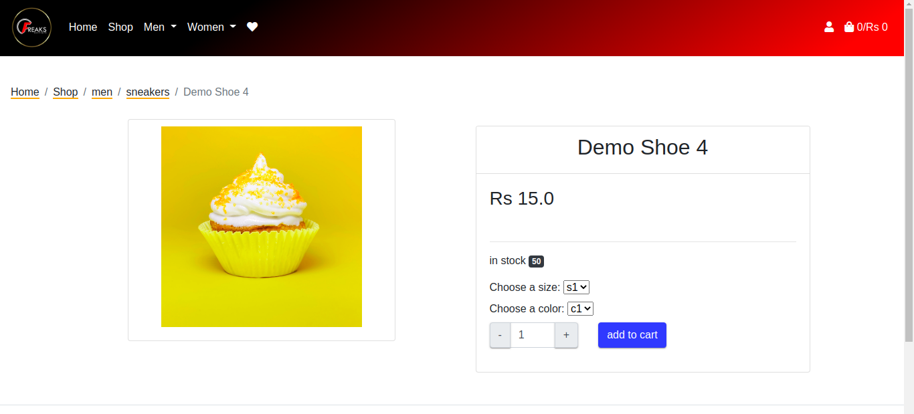
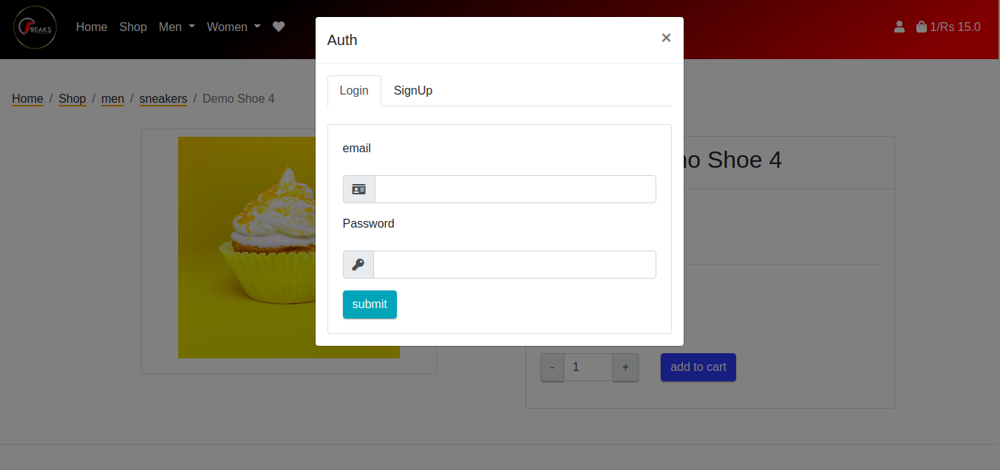
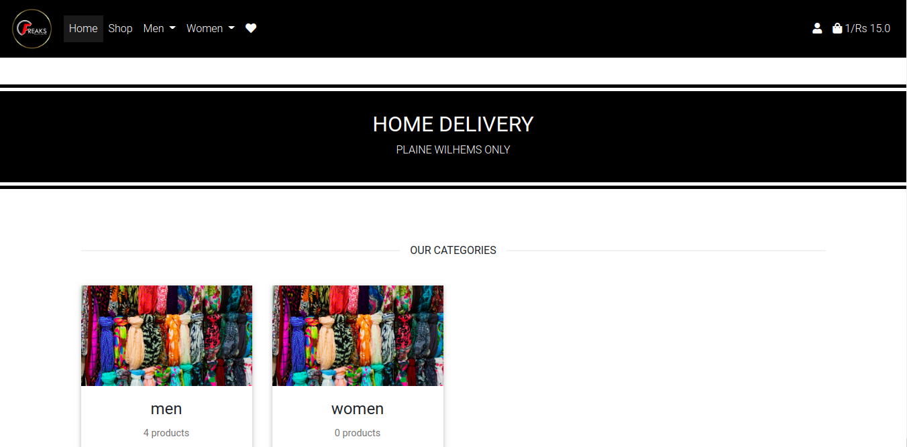
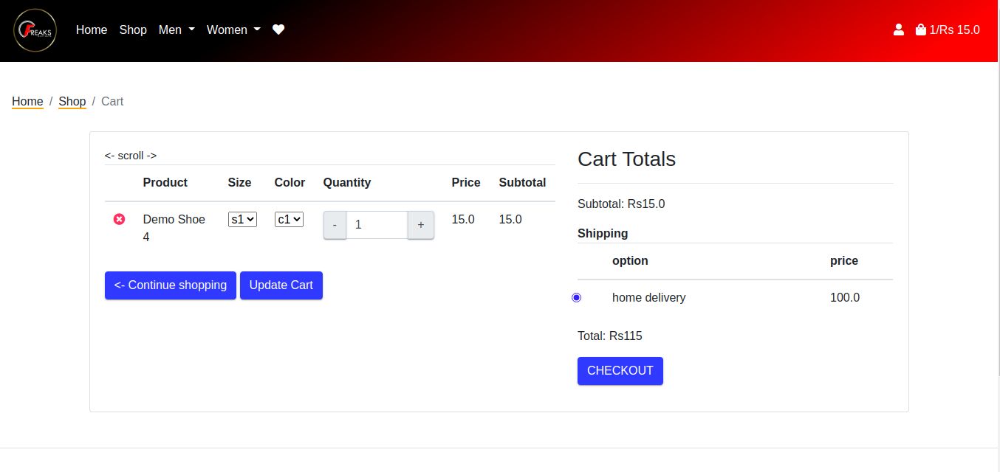

<div align="center">


[](https://www.firsttimersonly.com/)

🇲🇺 🇵🇰 🇳🇬 🇮🇳 

</div>

<div align="center">

[](https://discord.gg/k37Ef6w)
[](https://opencollective.com/shopyo)


</div>

# shopcube

shopcube is an e-commerce solution for shops. Complete with 

- [x] 🛒 cart
- [x] ⭐ wishlist
- [x] 📑 orders
- [ ] 📤 upload by csv
- [ ] 📊 charts


If you want to contribute, go ahead, we ❤️ it. We follow a 💯 % first-timers-friendly policy. Join [#shopcube](https://discord.gg/Gnys4C6xZX) if you get stuck or would just like to chat and say hi.

Powered by [Shopyo](https://github.com/shopyo/shopyo), a Python web framework built on top of Flask. 


## ⚡ Quick try


```
$ python -m pip install shopcube
$ shopcube initialise
$ shopcube rundebug
```

Go to [http://127.0.0.1:5000](http://127.0.0.1:5000)

## 🎫 Some explanations

Shopcube has two modes: 

- package mode if you want to just use the app as is
- control mode if you want to see exactly what's going on

Package mode has several commands to manage the json settings file

```
$ shopcube showjson # show settings
$ shopcube copyjson # copy json file from site-packages in current directory
$ shopcube applyjson # apply json file in current directory
$ shopcube restorejson # restore original json file in site-packages
$ shopcube create # create new project named shopcube in current directory
$ shopcube packageinfo # path of project
```

Control mode allows you to use Shopyo commands as you would in any project

```
$ shopcube create 
$ ls shopcube/
├── app.py
├── config.example.json
├── config.json
├── config.py
├── conftest.py
├── file.log
├── __init__.py
├── init.py
├── instance
├── __main__.py
├── modules
├── __pycache__
├── pyproject.toml
├── requirements.txt
├── setup.cfg
├── static
├── tests
├── utils
└── wsgi.py
$ cd shopcube
$ shopyo initialise
$ shopyo rundebug
```

## 🍼 First time setup

- Download and install the [latest version of git](https://git-scm.com/downloads).

- Configure git with your [username](https://docs.github.com/en/github/using-git/setting-your-username-in-git) and [email](https://docs.github.com/en/github/setting-up-and-managing-your-github-user-account/setting-your-commit-email-address).

  ```
  $ git config --global user.name 'your name'
  $ git config --global user.email 'your email'
  ```

- Make sure you have a [GitHub account](https://github.com/join).

- Fork shopcube to your GitHub account by clicking the [Fork](https://github.com/shopyo/shopcube/fork) button.

- [Clone](https://docs.github.com/en/github/getting-started-with-github/fork-a-repo#step-2-create-a-local-clone-of-your-fork) the main repository locally (make sure to have your [SSH authentication](https://docs.github.com/en/authentication/connecting-to-github-with-ssh/generating-a-new-ssh-key-and-adding-it-to-the-ssh-agent) setup!). Replace `{username}` with your username. 

  ```
  $ git clone git@github.com:{username}/shopcube.git
  $ cd shopcube
  ```

- Create a virtualenv named env and activate the [virtual environment](https://docs.python.org/3/tutorial/venv.html):

  Linux/macOS	

  ```
  $ python3 -m venv env
  $ . env/bin/activate
  ```

  Windows

  ```
  > py -3 -m venv env
  > env\Scripts\activate
  ```

- Upgrade pip and setuptools:

  ```
  $ python -m pip install --upgrade pip setuptools
  ```

- Install the development dependencies and shopcube requirements:

  ```
  $ python -m pip install -r reqs/dev.txt
  ```

- Now initialize the app by running:

  ```
  $ python -m pip install -e .
  $ cd src/shopcube
  $ shopyo initialise
  ```

- Run shopcube:

  ```
  $ shopyo rundebug
  ```

- Go to the link http://127.0.0.1:5000/ and you should see the shopcube app running. 

- Login as administrator by clicking on the login icon on the top right hand side of the screen. 

  Enter admin@domain.com as the username and 'pass' as the pasword. 

  After login, you should be directed to http://0.0.0.0:5000/dashboard/. 

  ```
  # see config.json 
   "admin_user": {
        "email": "admin@domain.com",
        "password": "pass"
    }
  ```

## ↩ Pull Requests

--> Add flag to readme

Make sure you have setup the repo as explained in [First time setup](https://shopyo.readthedocs.io/en/latest/contrib.html#setup) before making Pull Request (PR)

- Create a branch for the issue you would like to work on:

  ```
  $ git fetch origin
  $ git checkout -b <your-branch-name> origin/dev
  ```

  Note

  As a sanity check, you can run `git branch` to see the current branch you are on in case your terminal is not setup to show the current branch.

- Using your favorite editor, make your changes, [committing as you go](https://dont-be-afraid-to-commit.readthedocs.io/en/latest/git/commandlinegit.html#commit-your-changes).

  ```
  $ git add <filenames to commit>
  $ git commit -m "<put commit message here>"
  ```

- Push your commits to your fork on GitHub. The -u option allows your local branch to be pushed to your GitHub repo. 

  ```
  $ git push -u origin your-branch-name
  ```

- [Create a pull request](https://docs.github.com/en/github/collaborating-with-issues-and-pull-requests/creating-a-pull-request). You should see the PR link in the terminal after you successfully push your commits. Link to the issue being addressed with `fixes #123` in the pull request. See [example PR](https://github.com/shopyo/shopyo/pull/55).

## 🔨 Troubleshooting Guide

If you need further assistance, ping [@contributor](https://discord.gg/k37Ef6w) on discord. 

- When I initialise the app, I get an error related to MySQL (ie: a Connection Error)

  In `config.py`, make sure you have a database URI

    ```
    SQLALCHEMY_DATABASE_URI = "mysql+pymysql://{username}:{password}@{server_name}/{db_name}".format(
        username='shopcube',
        password='pass1234-A',
        server_name='localhost',
        db_name='shopcube'
    ) 
    ```

  or paste the following into `config.py` inside of the `class DevelopmentConfig(Config)`: 

  ```
  SQLALCHEMY_DATABASE_URI = 'sqlite:///' + os.path.join(base_path, 'app.db')
  ```

- I launched the app but nothing shows up in /dashboard. 

  - Log in as admin@domain.com with the password 'pass'

- Additional development insights?

  - Read the [shopyo](https://shopyo.readthedocs.io/en/latest/) docs!

## 🍳 In Action





