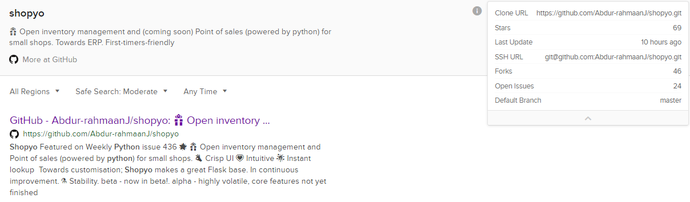
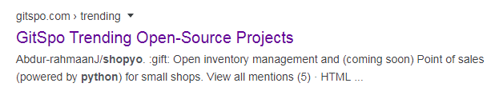
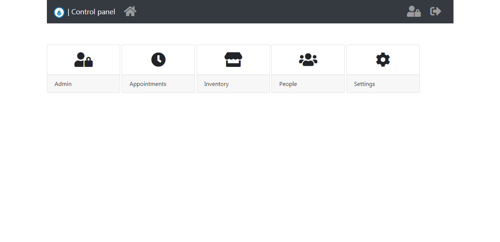
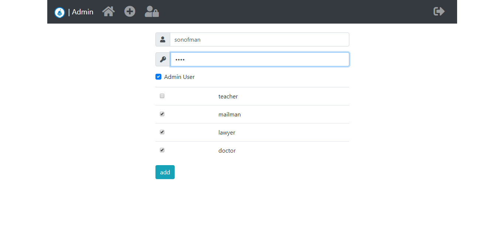
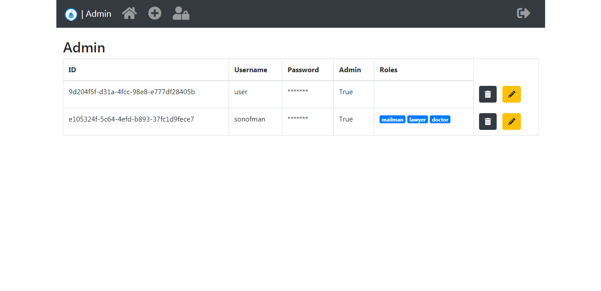
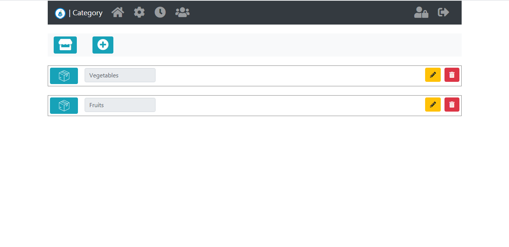
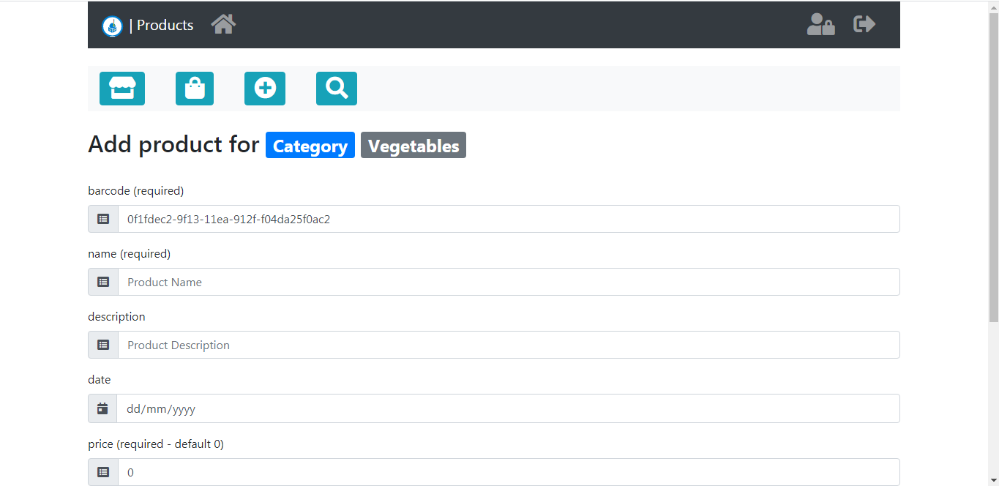
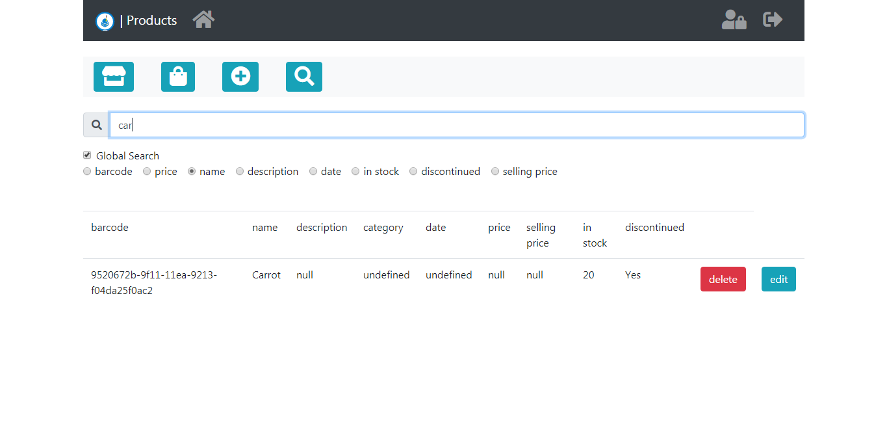
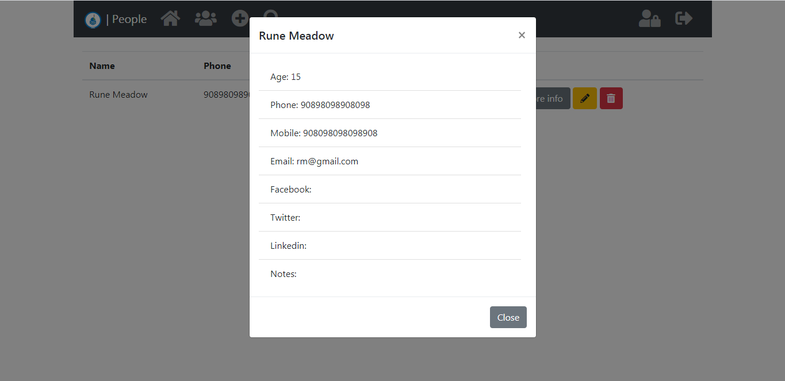
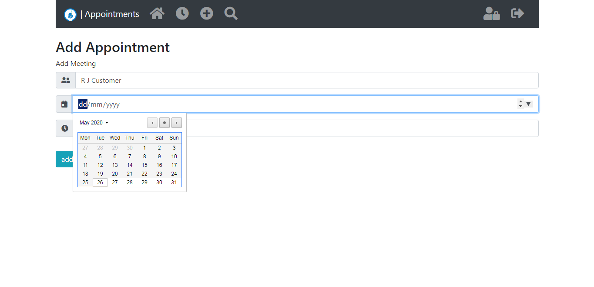

<h1 align="center">
  <br>
  <a href="https://github.com/Abdur-rahmaanJ"></a>
</h1>


Featured on [Weekly Python issue 436](https://newsletry.com/Home/Python%20Weekly/9a578693-14ba-47c5-8a8e-08d7b0139fe7) 🌟

🎁 Open inventory management  and Point of sales (powered by python) for small shops. 

- :ok_hand: Crisp UI
- :heartpulse: Intuitive
- :sparkler: Instant lookup
- :pencil2: Towards customisation

It also makes a great Flask base and supports commands such as:

`python manage.py startapp loans` 

# Test it out!

`pip install shopyo`

close and reopen your cmd

`shopyo new <path> <project folder>`

example:

`shopyo new /home/profiles/arj/desktop shopyotest`

then cd into the folder

`/home/profiles/arj/desktop`

then install requirements (install in venv if you like)

`pip install -r requirements.txt`

then

```
python manage.py initialise
python manage.py runserver
```

go to url ^^


# ⚗️ Stability

**beta** - now in beta!

~**alpha** - highly volatile, core features not yet finished~

<hr>

[](http://hits.dwyl.com/Abdur-RahmaanJ/shopyo)

# 💌 Contributing Countries

🇲🇺 🇩🇪 🇨🇳 🇬🇧 🇸🇬 🇺🇬 🇲x

# 🔥 Default Modules:

Basics:

- Control Panel
- Admin
- Base
- Login

Shop:

- Appointment
- Products
- People
- Internals
- Settings

If you want to use the project as a Flask base, just remove 
the shop modules in modules/

# 📜 Testimonial

 >  This is my first time contributing to a public repo and I have quite enjoyed it. If you're a ``first-time-contributor`` the community is very helpful and can help you progress. Since I have been helping in this repo, I have also learnt a few things myself. The owner of the repo is active and is always willing to help.
>
> Also, if I'm around and you're stuck give us a shout. I'll help if I can. ``@blips5``


# 📖 History

<details><summary><b>I want to learn!</b></summary>

Months ago, I was searching github for a point of sales solution that used Python. What bothered me was that many of the applications I found were not ideal. Some required Posgres with the expectation that a user would already have this installed, others had codebases that were a mess of spaghetti code, yet others were django-based accounting monsters ...

I decided to try making my own solution, modeled after a client request, I had once recived. I Made it flask-based with SQLalchemy and SQLite. You can instantly get started with no hassle, switching to something more powerful when you want to (since it uses an ORM)

For the UI, we used the latest, bootstrap4, fa5 and jq3. Interestingly enough, I had two shop owners try it and they were very impressed with the ease of use.

It is still in devolopment and supports instant lookup. Long story short, with some programming skills, you can solve some everyday problems. And yes, no cdn, all libs are bundled so that you can use it completely offline

</details>

See [this](https://www.linkedin.com/feed/update/urn:li:activity:6551367967978979328) linked-in article!

# 📰 In The News

- Shopyo is [announced on LinkedIn](https://www.linkedin.com/feed/update/urn:li:activity:6551367967978979328)
- Featured on Python Weekly issue 436
- [Bhavesh Solanki](https://www.linkedin.com/in/bhavesh-solanki26/) tells about his Open Source experience [contributing to Shopyo](https://www.linkedin.com/feed/update/urn:li:activity:6569959051420098560/) on LinkedIn
- [Arthur Nangai](https://www.linkedin.com/in/arthur-nangai/) from Andela joins the project as 3rd core committer
- Project goes officially in Beta, v1.0.0 released
- Duckduckgo recognises Shopyo

- Shopyo becomes a trending OpenSource project


# Who uses Shopyo?

| site name | description
|:---:|:---:|
|Maurilearn.com|Elearning platform|

# TODO modules

- Point of Sales
- Accounting

# 🔧 Install instructions

- download python3.8
- clone and cd into project
- run ```python -m pip install -r requirements.txt```
- run ```python -m pip install -r dev_requirements.txt``` if you want to contribute

# 👟 Run instructions

``cd`` into shopyo/shopyo if not already.

initialise and setup app.

```python
python manage.py initialise
```

run the app.

```python
python manage.py runserver
```

go to the indicated url

**Super User password**

```python
User ID: user 
password: pass
```

# 🔩 Migrations

In case of change to models, do

```
python manage.py db migrate
pyhton manage.py db upgrade
```
# Testing
The application makes use of `end to end` tests.  To get these up and running you will need [selenium](https://www.selenium.dev/) and a [chrome web driver](https://tecadmin.net/setup-selenium-chromedriver-on-ubuntu/).
- The chromedriver is already part of the applciation folder.
- To run tests cd into the `shopyo folder` and run the command. `pytest`.
- To ensure your code meets PEP8 standard, run the command. `flake8 shopyo`.

# Complete commands

initialise database.

```
python manage.py db init # create db from new
python manage.py db migrate
python manage.py db upgrade
```

**clean project**

```
python manage.py clean
```

removes `__pycache__/`, `test.db` and ``migrations``.

**create new module**

`python manage.py startapp modulename`

**run server**

```
python manage.py rundebug
python manage.py runserver
```


**create new module**

# :scroll: Docs
Sphinx docs generater
       
Run

```
sphinx-build -b html sphinx_source docs
```


in `shopyo/` to generate docs

[Read the docs for Sphinx Alablaster](
https://alabaster.readthedocs.io/en/latest/ "Sphinx Alablaster") 
     
# :construction: Developing Modules

Modules are found in the modules folder.

A typical structure is as follows:

```
apple/
    templates/
        apple/
    view.py
    models.py
    info.json
```

You must ensure that
- The view is named `view.py`
- The info is named `info.json`
- The module folder and the folder inside templates both have the same name
- Blueprints must be named `<nameofmodulefolder>_blueprint`, in this demo `apple_blueprint`

And ... the app will load all the modules, just make sure in info.json you keep url_prefix, type, name, and fa-icon

For the time being it's best to look into existing modules and do the same.

# ♨️ Contributing

Shopyo internals explained here: [Shopyo: Enhance Your Flask by Exploring An Advanced Flask App](https://dev.to/abdurrahmaanj/shopyo-enhance-your-flask-by-exploring-an-advanced-flask-app-40j3)


If you want to contribute, go ahead, we ❤️ it. We follow a 💯 % first-timers-friendly policy.
- Fork repo.
- Create a new branch. For example: `bg-fix-migration-file`.
- Once you have add your changes ensure tests are still passing.
- Add tests for any new functionality added.
- Ensure you commits follow the standard specified [here](https://udacity.github.io/git-styleguide/).
- Follow the Pull request [template](.PULL_REQUEST_TEMPLATE.md).
- Add your country flag in readme after accepted PR

- Update fork as below then
- Push
```
git push origin <branch-name>
```
- If it closes an issue, add `Fixes #94` for example, as seen [here](https://github.com/Abdur-rahmaanJ/shopyo/pull/95)
-  PR against `dev` branch, not master

# Update Fork

```
cd <your/local/cloned/repo/path/here>
git remote add upstream https://github.com/Abdur-rahmaanJ/shopyo.git
git fetch upstream
git pull upstream master
```


# 💬 Community: Discord
[https://discord.gg/k37Ef6w](https://discord.gg/k37Ef6w)

# FaQ

**Why do we need another folder in templates?**

Flask loads all templates in one namespace. If you specify `apple/index.html` flask will load the index.html in the apple folder in templates


# Roadmap

- ✔️ Models
- ✔️ Migrations
- ✔️ Restful Api
- ✔️ Manage.py
- ✔️ CSRF protection
- ✔️ Easy dev/production mode switch
- ✔️ Login
- ✔️ Api namespacing / apps
- ✔️ Django-like structure (where models, views and templates all in one  folder)
- ✔️ Relative reference (.forms for example)
- ✔️ Roles management

In Progress

- 🔃 Unit tests
- 🔃 Integration tests
- 🔃 Permission levels

# Contributing main options via __main__

- clone project
- create and activate venv
- cd into project folder
- run `pip install -e .`
- after changes run `pip install -e . --upgrade`
- test `shopyo <your options>`


# 📞 Contact

Support team if you are stuck

- [Abdur-Rahmaan Janhangeer](https://github.com/Abdur-rahmaanJ) - arj.python@gmail.com
- [Nathan](https://github.com/blips5) - 
- [Arthur Nangai](https://github.com/arthurarty) - arthurnangaiarty@yahoo.co.uk 


## 🍳 In Action













## credits

digits.net
