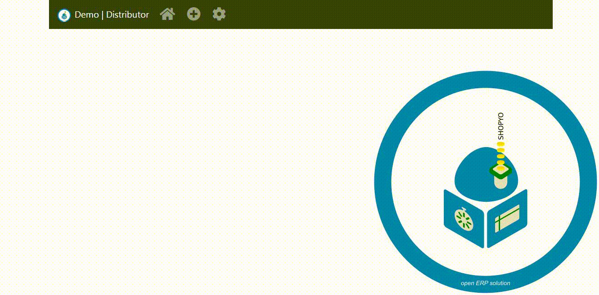

<h1 align="center">
  <br>
  <a href="https://github.com/Abdur-rahmaanJ"></a>
  <br>
  Shopyo
  <br>
</h1>

Featured on [Weekly Python issue 436](https://newsletry.com/Home/Python%20Weekly/9a578693-14ba-47c5-8a8e-08d7b0139fe7) 🌟

🎁 Open inventory management  and Point of sales (powered by python) for small shops. 

- :ok_hand: Crisp UI
- :heartpulse: Intuitive
- :sparkler: Instant lookup
- :pencil2: Towards customisation

# ⚗️ Stability

**alpha** - highly volatile, core features not yet finished

# 💌 Contributing Countries

🇲🇺 🇩🇪 🇨🇳 🇬🇧 🇸🇬 🇺🇬

# 🔥 Just Added Features

- Confirmation before deleting section
- Settings fully operationable
- Apply settings works for existing and non-existing db
- Instantly checks duplicate


- Appointment section

# Testimonial

 >  This is my first time contributing to a public repo and I have quite enjoyed it. If you're a ``first-time-contributor`` the community is very helpful and can help you progress. Since I have been helping in this repo, I have also learnt a few things myself. The owner of the repo is active and is always willing to help.
>
> Also, if I'm around and you're stuck give us a shout. I'll help if I can. ``@blips5``


# Understand Shopyo

Shopyo internals explained here: [Shopyo: Enhance Your Flask by Exploring An Advanced Flask App](https://www.pythonmembers.club/2020/02/25/shopyo-enhance-your-flask-by-exploring-an-advanced-flask-app/)
  

# 📖 History

<details><summary><b>I want to learn!</b></summary>

Months ago, I was searching github for a point of sales solution that used Python. What bothered me was that many of the applications I found were not ideal. Some required Posgres with the expectation that a user would already have this installed, others had codebases that were a mess of spaghetti code, yet others were django-based accounting monsters ...

I decided to try making my own solution, modeled after a client request, I had once recived. I Made it flask-based with SQLalchemy and SQLite. You can instantly get started with no hassle, switching to something more powerful when you want to (since it uses an ORM)

For the UI, we used the latest, bootstrap4, fa5 and jq3. Interestingly enough, I had two shop owners try it and they were very impressed with the ease of use.

It is still in devolopment and supports instant lookup. Long story short, with some programming skills, you can solve some everyday problems. And yes, no cdn, all libs are bundled so that you can use it completely offline

</details>

See [this](https://www.linkedin.com/feed/update/urn:li:activity:6551367967978979328) linked-in article!

# ♨️ Contributing

If you want to contribute, go ahead, we ❤️ it. We follow a 💯 % first-timers-friendly policy.

- Add your country flag in readme after accepted PR

# 💬 Community: Discord
[https://discord.gg/k37Ef6w](https://discord.gg/k37Ef6w)

# 🔧 Install instructions

- download python3.7
- clone and cd into project
- run ```python -m pip install -r requirements.txt```

# 👟 Run instructions

``cd`` into shopyo/shopyo if not already.

initialise database.

```
python manage.py db init
python manage.py db migrate
python manage.py db upgrade
```

initialise and setup app.

```python
python manage.py initialise
```

run the app.

```python
python manage.py runsever
```

go to the indicated url

**Super User password**

```python
User ID: user 
password: pass
```

# 🔩 Migrations

In case of change to models, do

```
python manage.py db migrate
pyhton manage.py db upgrade
```

# :construction: Developing a template.

<details><summary><b>Show me how</b></summary>

Each landing page and subsection should contain the following headers.


```` //  extends the base.html file.

```` // sets the active section (change section name).


#### Create the main landing page of a new section in the template folder.

Inside the template folder create a folder named as you want

```
/template
    /base
    /<changeme> (swap <changeme> for section name).
        index.html
```

#### Create a subsection template.

Inside the template folder create a new file under the folder named same as the section.

```
/template 
    /base
    /section_name
        index.html
        anotherfile.html 
```

#### Create navigation elements for a new section.


Inside the template folder create a file named ``nav.html``.

```
/template
    /base
    /example_section_name
        index.html
        nav.html
```

In the  ```nav.html```  file elements for the navigation can be created.


#### To display the navagation elements.

Open the template ``/base`` folder and locate the ``nav_base.html``.

In the ``nav_bar_log([])`` array. Enter the section name last in the list.


```python3


Now enter a new elif statement containing a reference to the _nav.html

    
      
      
    
      

     <- - - Add 1 to index.
      
```

Then the navagation elements will be displayed in the new section.

</details>


# Windows Deployment

<details><summary><b>Show me how</b></summary>

[youtube demo](https://youtu.be/fOUEyuMgZ0U)

</details>

## 🍳 In Action


# Roadmap

- ✔️ Models
- ✔️ Migrations
- ✔️ Restful Api
- ✔️ Manage.py
- ✔️ CSRF protection
- ✔️ Easy dev/production mode switch
- ✔️ Login
- ✔️ Api namespacing / apps

In Progress

- 🔃 Unit tests
- 🔃 Integration tests
- 🔃 Permission levels
- 🔃 Django-like structure (where models, views and templates all in one  folder)

Crossed Out

- ✖️ Forms (We believe it should be to the front-end designer's taste)

