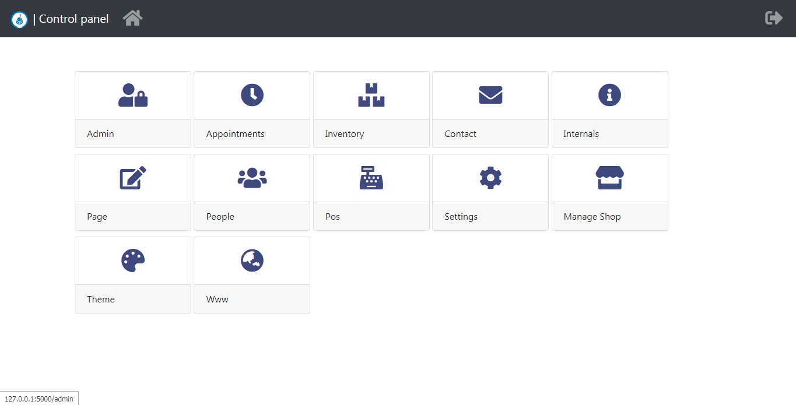
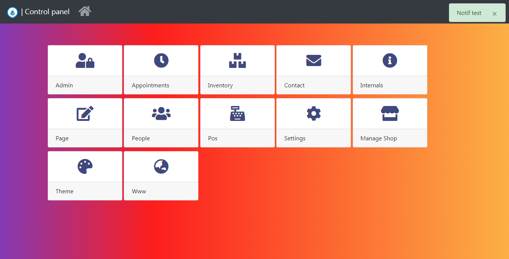

<h1 align="center">
  <br>
  <a href="https://github.com/Abdur-rahmaanJ"></a>
  
  
</h1>

[](https://codecov.io/gh/Abdur-rahmaanJ/shopyo)  [](https://pypi.python.org/pypi/shopyo/)

Featured on [Weekly Python issue 436](https://newsletry.com/Home/Python%20Weekly/9a578693-14ba-47c5-8a8e-08d7b0139fe7) 🌟

A 45 mins talk was dedicated to it at [EuroPython](https://youtu.be/rkzXQOC1T0Q) 🌟

E-commerce modules transferred to [ShopCube](https://github.com/shopyo/shopcube)

**[ [DOCS](https://shopyo.readthedocs.io/en/latest/) | [DISCORD](https://discord.gg/k37Ef6w) | [CONTRIBUTE](https://shopyo.readthedocs.io/en/latest/contrib.htm) | [TWITTER](https://twitter.com/shopyo1) ]**

# What?

Your next-level modular web framework. Headless support coming soon. 

Built on top of Flask, it offers most Django features, sometimes a tidbit more with far more flexibility.

It ships with common business needs by default

# Have a go!

`pip install shopyo`

then
```
shopyo new blog
cd blog/blog
python manage.py initialise
python manage.py rundebug
```

It is recommended to use a venv in root folder. 

`python -m venv venv`

If for dev install dev_requirements.txt also. 

`python -m pip install -r dev_requirements.txt`

go to http://127.0.0.1:5000/dashboard with credentials admin@domain.com / pass


* Not framework docs but docs for the project you are building.

# First time contributing?

We have a 100% first-timers friendly policy. Check out the [testimonials](https://github.com/Abdur-rahmaanJ/shopyo/discussions/307).

# Big??

Powered by apps / modules. Add as many as you like. 

Apps are not enough, organise them in boxes and get the ultimate order you need.

You need a customised Django? This is the project. You need to build an ERP? This is the project.

# Linux??

Hackable to the core. Even the dashboard is but a module.

Don't need our modules? Nuke them. Look boring? modify them

# Reliable?

We don't maintain middlewares. We rely on battle tested batteries like:

- flask_sqlalchemy
- flask_login & co

Heck remove them if you don't want. Want to use Peewee? You can.

# Rich Flask API

Common flask patterns are integrated, the structure is over the moon.

Common flask tasks are provided with an API: custom notifications, bulk form errors

# Back office feel & Theme

All looks are 100% customisable with themes ~ Backend, bootstrap included by default.

Again blow it up & use what you want. It's possible

# Transparent: Code your own web distro

Everything is clear, not hidden. You can 100% customise whatever you want.

We did not hardcode our choices. Our APIS are incremental. You can always use barebones.

# Plug & Play

The modules are put by copy paste. No blueprint codes to write. 

# Contribute

We follow a 100% first-timers friendly policy.

👉 Get started [here](https://shopyo.readthedocs.io/en/latest/contrib.html)

👉 Join the [Discord](https://discord.gg/k37Ef6w), ask questions & learn about Flask tricks during our dev talks!

# 📚 Docs

👉 Link: [shopyo.readthedocs.io/](https://shopyo.readthedocs.io/en/latest/)

# By default

We include some custom apps to get started and act as a demo:

- ecommerce
- appointment
- pages
- contact

# 🍜 Test it out!

| Info | Value |
|---|---|
| Link | [shopyo.pythonanywhere.com/dashboard](http://shopyo.pythonanywhere.com/dashboard) |
| Credentials | User: admin@domain.com - password: pass |

# Who uses Shopyo?

| site name | description
|:---:|:---:|
|Maurilearn.com|Elearning platform|
|Linkolearn.com|Learn By links|

# 📞 Contact

Support team if you are stuck

- [Abdur-Rahmaan Janhangeer](https://github.com/Abdur-rahmaanJ) - arj.python@gmail.com
- [Nathan](https://github.com/blips5) - 
- [Arthur Nangai](https://github.com/arthurarty) - arthurnangaiarty@yahoo.co.uk 
- [Shamsuddin Rehmani](https://github.com/rehmanis) - rehmani@usc.edu


## 🍳 In Action





## Supporters

[](https://github.com/abdur-rahmaanj/shopyo/stargazers)

[](https://github.com/abdur-rahmaanj/shopyo/network/members)

